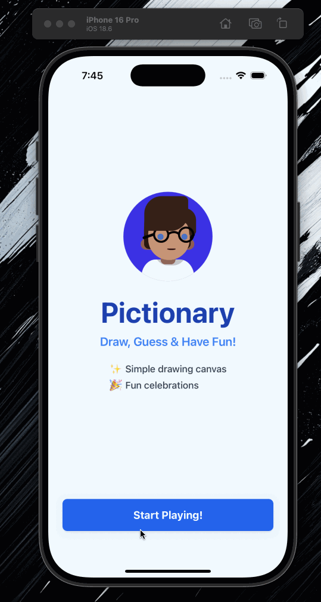

# Pictionary MVP

A simple React Native Pictionary game.

## Demo



## Tech Stack

- **Expo** - React Native development platform
- **React Native** - Drawing canvas implementation
- **TypeScript** - Type safety
- **Rive RectNative Wrapper** - Animations

## Installation & Setup

1. Clone the repository:
```bash
cd rive-pictionary
```

2. Install dependencies:
```bash
npm install
```

3. Install iOS dependencies (required for iOS development):
```bash
cd ios
pod install
cd ..
```

4. Start the development server:
```bash
npx expo run:ios
```

5. Open the app:
   - Scan the QR code with Expo Go on your mobile device
   - Or press `i` for iOS simulator or `a` for Android emulator

### Prerequisites

- **Node.js** (v16 or higher)
- **npm** or **yarn**
- **CocoaPods** (for iOS development): Install with `sudo gem install cocoapods`
- **Xcode** (for iOS development on macOS)
- **Android Studio** (for Android development)

## Project Structure

```
src/
├── components/
│   ├── Canvas/
│   │   ├── DrawingCanvas.tsx    # SVG-based drawing component
│   │   └── CanvasControls.tsx   # Canvas controls (clear, undo)
│   ├── Animations/
│   │   ├── CelebrationAnimationModal.tsx  # Celebration animation
│   │   └── MascotRive.tsx      # Mascot animation
│   └── UI/
│       ├── AnimatedButton.tsx   # Reusable animated button
│       └── GameTimer.tsx       # Countdown timer component
├── screens/
│   ├── WelcomeScreen.tsx       # Welcome/intro screen
│   ├── GameSetupScreen.tsx     # Player setup and configuration
│   ├── DrawingScreen.tsx       # Drawing interface screen
│   └── GameScreen.tsx          # Main game coordinator
├── services/
│   ├── GameService.ts          # Game logic and state management
│   └── WordService.ts          # Word management and selection
└── assets/
    └── animations/
        ├── avatar-pack.riv    # Avatar Rive animations (demo)
```


